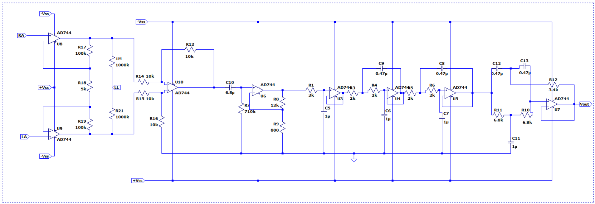

# Heart Rate Monitor

## Table of Contents
- [Introduction](#introduction)
- [Functionality](#functionality)
- [Printed Circuit Board](#printed-circuit-board)
- [Enclosure Design](#enclosure-design)
- [Contributors](#contributors)

## Introduction
An electrocardiogram (ECG) is a diagnostic technique used to analyze the heart’s electrical activity by detecting the signals generated during each heartbeat through electrodes placed on the skin. The voltage difference between the right arm and left arm is amplified, incorporating a feedback mechanism through the right leg. ECG leads measure these voltages from the right arm, left arm, and right leg.  

The signal amplitude typically ranges from 0.001 mV to 100 mV (average ~1 mV) and spans a frequency range of 0.01 Hz to 250 Hz. Amplifying such a weak signal is challenging due to interference from multiple sources such as noise, power line interference, RF interference, electrode contact noise, stray capacitance, and motion-induced artifacts.  

In this project, I designed and implemented an **analog signal conditioning circuit** to amplify and filter the ECG signal using only fundamental electronic components such as resistors, capacitors, and operational amplifiers. The system provides clean ECG waveform acquisition suitable for heart rate monitoring.  

The block diagram below illustrates the various stages of the signal conditioning system implemented in the design.  

The circuit was simulated and verified using **LTSpice** and **Multisim** prior to PCB design and implementation.

## Functionality
The Heart Rate Monitor provides the following key features:
- Real-time heart rate detection and display.  
- Simple and user-friendly operation.  
- High accuracy through analog filtering and noise suppression.  
- Adjustable filtering parameters for different test scenarios.  
- Data logging capability for further analysis.  
- Fully documented design and workflow for ease of replication.  

